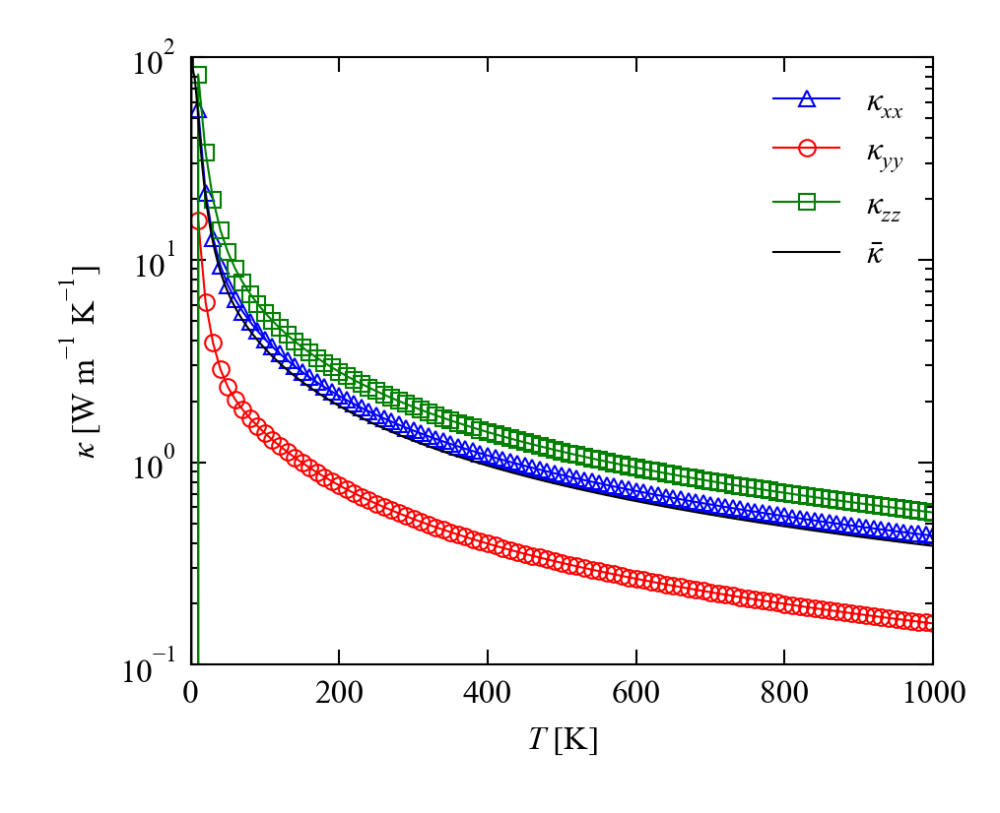

# phono3py-get-kappa

`phono3py-get-kappa` is a simple command-line script to extract the thermal-conductivity tensors (<b><i>&kappa;</i></b><sub>latt</sub>) from the `kappa-m*.hdf5` files produced by Phono3py.

The program writes the six unique elements of <b><i>&kappa;</i></b><sub>latt</sub> at each calculation temperature to a comma-separated values (CSV)-format text file.
It also calculates and outputs the isotropic average <i>&kappa;</i><sub>iso</sub> = (<i>&kappa;<sub>xx</sub></i> + <i>&kappa;<sub>yy</sub></i> + <i>&kappa;<sub>zz</sub></i>) / 3.

The CSV format is very simple and easily read by most analysis and visualisation software.
(For an example of how to read and plot the data in Python, see below.)


## Installation and requirements

No installation is necessary.
For ease of use on Unix(-like) systems, you may wish to add the scripts folder to your `$PATH` variable - e.g.:

```bash
export PATH=${PATH}:/mnt/d/Repositories/Phono3py-Tools
```

`phono3py-get-kappa` requires the [H5py package](https://www.h5py.org), which is also used by Phono(3)py.


## Usage examples

To extract data from a Phono3py HDF5 file, run the script with the file path - e.g.:

```bash
$ phono3py-get-kappa kappa-m161616.hdf5
```

By default, `phono3py-get-kappa` writes output files to the current working directory named `<root>.csv`, so the command above will output the data to a file named `kappa-m161616.csv`.
The CSV format is one row per line with headers/values separated by commas:

```
T [K],k_xx [W/m.K],k_yy [W/m.K],k_zz [W/m.K],k_yz [W/m.K],k_xz [W/m.K],k_xy [W/m.K],k_iso [W/m.K]
0.0,0.0,0.0,0.0,0.0,0.0,0.0,0.0
10.0,55.07339604014415,15.693212221821625,82.24785666053268,1.6022468809599445e-17,-7.671283605723772e-15,-5.898830900512673e-34,51.00482164083282
20.0,21.4688557567765,6.16560852088868,33.95198398725003,2.4801540741230823e-18,-3.1109728142044685e-15,-3.7708283987080234e-35,20.52881608830507
30.0,12.829446029165446,3.8886640431286335,19.874474063726712,-1.0245685468343207e-18,-1.8433243372704187e-15,1.5010928438204353e-35,12.197528045340263
40.0,9.33311620472965,2.8759553824371076,13.998472815827432,-1.4416382736688985e-18,-1.319249003270521e-15,2.343224246251316e-35,8.735848134331397
50.0,7.497596082528465,2.3535572873071198,10.911024851520345,-1.3378251274424403e-18,-1.0434576243120703e-15,2.428404832022923e-35,6.9207260737853105
60.0,6.350972715989032,2.0379983032786004,9.021988516551945,-1.1694887651441092e-18,-8.729406642763391e-16,2.3500289482360983e-35,5.803653178606527
70.0,5.544742745783705,1.8177554501382969,7.73450748243381,-1.0181459436311814e-18,-7.54995533492234e-16,2.227519947979205e-35,5.0323352261186045
80.0,4.933802590537467,1.6479669635208298,6.789558283080802,-8.940712462477584e-19,-6.671238157723123e-16,2.0944009912124933e-35,4.4571092790463664
90.0,4.448623617065409,1.5092008348755863,6.059985228460045,-7.938734251588838e-19,-5.983770116811075e-16,1.9633114805814556e-35,4.00593656013368
100.0,4.051303739267106,1.3919940640409125,5.476318212926482,-7.124858258576519e-19,-5.42770676491479e-16,1.839562132785157e-35,3.6398720054114997
```

The default output file name can be overridden using the `-o`/`--output-file` command-line option:

```bash
$ phono3py-get-kappa kappa-m161616.hdf5 -o kappa.csv
```

`phono3py-get-kappa` can accept multiple input files.
Using the automatic naming, this makes it easy to process a directory with multiple files, as might for example be generated from a mesh convergence test:

```bash
$ phono3py-get-kappa kappa-m*.hdf5
```

(Note that the `-o`/`--output-file` option does not work when more than one input file is specified.)


## Working with CSV files in Python

The following function can be used to read the CSV files produced by `phono3py-get-kappa` into a Python script:

```python
import csv

import numpy as np

...

def ReadKappaCSV(file_path):
    # 8 columns: T, k_xx, k_yy, k_zz, k_xz, k_yz, k_xy, k_ave.
    
    data_cols = [
        [] for _ in range(0, 8)
        ]
    
    # Read input file.
    
    with open(file_path, 'r') as input_reader:
        input_reader_csv = csv.reader(input_reader)
        
        # Skip header row.
        
        next(input_reader_csv)
        
        for row in input_reader_csv:
            for i, val in enumerate(float(item) for item in row):
                data_cols[i].append(val)
    
    # Convert lists to NumPy arrays and return.
    
    return [
        np.array(data_col, dtype = np.float64)
            for data_col in data_cols
        ]
```

The following example plotting script reads the temperature, the diagonal <i>&kappa;<sub>xx</sub></i>, <i>&kappa;<sub>yy</sub></i> and <i>&kappa;<sub>zz</sub></i> components of <b><i>&kappa;</i></b><sub>latt</sub> and the average <i>&kappa;</i><sub>iso</sub> from a CSV file and plots them using [Matplotlib](https://matplotlib.org):

```python
import matplotlib.pyplot as plt

...

t, k_xx, k_yy, k_zz, _, _, _, k_ave = ReadKappaCSV(r"kappa-m161616.csv")

plt.figure(
    figsize = (8.6 / 2.54, 7.0 / 2.54)
    )

plot_data = [
    (k_xx , r"$\kappa_{xx}$" , 'b', '^'),
    (k_yy , r"$\kappa_{yy}$" , 'r', 'o'),
    (k_zz , r"$\kappa_{zz}$" , 'g', 's')
    ]

for y_data, label, colour, marker in plot_data:
    plt.plot(
        t, y_data, label = label, color = colour,
        marker = marker, markersize = 4.0, markerfacecolor = 'none', markeredgecolor = colour
        )

plt.plot(
    t, k_ave, label = r"$\bar{\kappa}$", color = 'k'
    )

plt.yscale('log')

plt.xlim(0.0, 1000.0)
plt.ylim(1.0e-1, 1.0e2)

plt.legend(
    loc = 'upper right', frameon = False
    )

plt.xlabel(r"$T$ [K]")
plt.ylabel(r"$\kappa$ [W m$^{-1}$ K$^{-1}$]")

plt.tight_layout()

plt.savefig(
    r"Kappa.png", dpi = 300
    )
```


