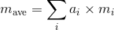
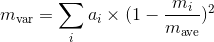
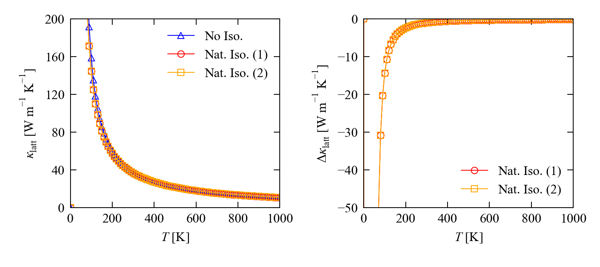
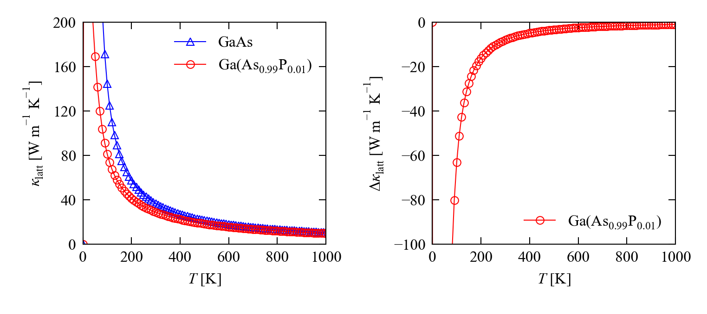
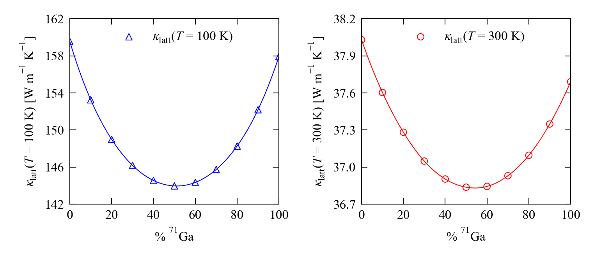

# phono3py-isotopes

`phono3py-isotopes` is a simple script to generate Phono3py input parameters for simulating the effect of mass variation at atomic sites on the lattice thermal conductivity <i>&kappa;</i><sub>latt</sub>.


## Theory

The average atomic masses <i>m</i><sub>ave</sub> directly affect the phonon frequencies <i>&omega;<sub>&lambda;</sub></i> *via* the dynamical matrix ***D***(**q**), and also appear in the expression for the three-phonon interaction strengths <i>P<sub>&lambda;</sub></i> used to calculate the linewidths &Gamma;<sub><i>&lambda;</i></sub>.
More details and formulae can be found in [Ref. 1](#Ref1).

In Phono3py, the average mass at the atomic sites in the input structure can be set using the `--mass` command-line option or the corresponding `MASS` settings tag.
For sites with *i* isotopes with fractional abundance <i>a<sub>i</sub></i> and mass <i>m<sub>i</sub></i> the average mass is calculated as:



The natural mass variation at atomic sites due to the presence of isotopes with different masses can introduce additional "isotope scattering" and thus reduce <i>&kappa;</i><sub>latt</sub>.
In Phono3py, isotope effects can be included using the model in [Ref. 2](#Ref2).
The required parameter is the "mass variance" <i>m></i><sub>var</sub>, which is calculated using the formula:



The mass variance at the atomic sites can be set using the `--mass-variances`/`--mv` command-line parameters or the corresponding `MASS_VARIANCES` tag.


## Installation and requirements

No installation is necessary, but you may wish to add the script folder to your `$PATH` variable - e.g.:

```bash
export PATH=${PATH}:/mnt/d/Repositories/Phono3py-Power-Tools
```

`phono3py-isotopes` reads isotope data from the Phonopy database, and therefore requires the `phonopy` Python library to be installed.


## Brief tutorial


### a. Natural isotopic abundance <a name="Tutorial.A"></a>

To obtain the appropriate `--mass-variances` tag to input the natural isotopic mass variance into Phono3py, run `phono3py-isotopes` with the list of atoms in the crystal structure (in site order):

```bash
$ phono3py-isotopes Ga As
```

The program prints for each atomic site a list of isotopes with their abundance and mass, followed by the calculated average mass and mass variance.
The `--mass` and `--mass-variances` tags to input into Phono3py are printed at the end of the output.

```
Site 1 (Ga)
-----------

  69_Ga   : a_i =  60.11 %, m_i =   68.92558
  71_Ga   : a_i =  39.89 %, m_i =   70.92471

  m_ave = 69.72307
  m_var = 1.97127e-04


Site 2 (As)
-----------

  75_As   : a_i = 100.00 %, m_i =   74.92160

  m_ave = 74.92160
  m_var = 0.00000e+00


To input this data into Phono3py:
---------------------------------
  --mass="69.72307 74.92160"
  --mass-variances="1.97127e-04 0.00000e+00"
```

We can now perform Phono3py calculations with and without the mass variance:

```bash
$ phono3py --dim="2 2 2" --dim-fc2="3 3 3" --pa="0 1/2 1/2  1/2 0 1/2  1/2 1/2 0" \
    --fc2 --fc3 -v --br --mesh="32 32 32"
```

```bash
$ phono3py --dim="2 2 2" --dim-fc2="3 3 3" --pa="0 1/2 1/2  1/2 0 1/2  1/2 1/2 0" \
    --fc2 --fc3 -v --br --mesh="32 32 32" --read-gamma \
	--mass="69.72307 74.92160" --mass-variances="1.97127e-04 0.00000e+00" -o "iso.nat.a"
```

This example is purely for illustrative purposes, because (a) the atomic masses used are the Phono3py defaults, so do not actually need to be set in this case, and (b) the natural isotopic mass variance can be set automatically using the `--isotope` tag:

```
$ phono3py --dim="2 2 2" --dim-fc2="3 3 3" --pa="0 1/2 1/2  1/2 0 1/2  1/2 1/2 0" \
    --fc2 --fc3 -v --br --mesh="32 32 32" --read-gamma --isotope -o "iso.nat.b"
```

As expected, the last two commands give practically the same result.*

<table>
  <tr>
    <th rowspan="2">Calc.</th>
    <th colspan="2"><i>&kappa;</i><sub>latt</sub> [W m<sup>-1</sup> K<sup>-1</sup>]</th>
  </tr>
 <tr>
    <th><i>T</i> = 100 K</th>
    <th><i>T</i> = 300 K</th>
  </tr>
  <tr>
    <td>No Iso.</td>
    <td>158.9</td>
    <td>37.89</td>
  </tr>
  <tr>
    <td>Nat. Iso. (1)</td>
    <td>144.6</td>
    <td>36.90</td>
  </tr>
  <tr>
    <td>Nat. Iso. (2)</td>
    <td>144.6</td>
    <td>36.90</td>
  </tr>
</table>



\* The results are not _exactly_ the same.
This is because Phonopy has two different databases - a list of average masses, and a higher-precision list of isotopic masses used to calculate mass variances when the `--isotope` flag is set.
`phono3py-isotopes` uses the latter database for both, so the masses specified in the `--mass` tag will usually be slightly different to the defaults.
In practice, the differences in the calculated <i>&kappa;</i><sub>latt</sub> are negligably small.


### b. Site mass disorder <a name="Tutorial.B"></a>

Suppose we replaced 1 % of the As with P.
The effect of this doping/alloying on the thermal transport can be modelled approximately* by changing the average mass and mass variance at the anion site.
The appropriate `--mass` and `--mass-variances` tags to input this into Phono3py can be generated with `phono3py-isotopes` using the `--site-average` option.

```bash
$ phono3py-isotopes Ga, As P --site-average --site-occupation="1.0, 0.99 0.01"
```

The comma in the list of atomic symbols delineates atoms at the two atomic sites - Site 1 has Ga, and Site 2 has a mix of As and P.
A corresponding list of site occupation fractions is also set with the `--site-occupation` parameter.
Note that `phono3py-isotopes` also includes the natural isotopic mass variation when calculating the average mass and mass variance for mixed sites.

Running the command above produces the following output:

```
Site 1 (Ga)
-----------

  69_Ga   : a_i =  60.11 %, m_i =   68.92558
  71_Ga   : a_i =  39.89 %, m_i =   70.92471

  m_ave = 69.72307
  m_var = 1.97127e-04


Site 2 (As, P)
--------------

  75_As   : a_i =  99.00 %, m_i =   74.92160
  31_P    : a_i =   1.00 %, m_i =   30.97376

  m_ave = 74.48212
  m_var = 3.44672e-03


To input this data into Phono3py:
---------------------------------
  --mass="69.72307 74.48212"
  --mass-variances="1.97127e-04 3.44672e-03"
```

We can now input these parameters into Phono3py:

```bash
$ phono3py --dim="2 2 2" --dim-fc2="3 3 3" --pa="0 1/2 1/2  1/2 0 1/2  1/2 1/2 0" \
    --fc2 --fc3 -v --br --mesh="32 32 32" \
    --mass="69.72307 74.48212" --mass-variances="1.97127e-04 3.44672e-03" -o "As99-P1"
```

Note that we did not use the `--read-gamma` tag as in the previous example.
The doping changes the average mass as well as the mass variance, which will in turn affect the phonon spectrum and the linewidths.

<table>
  <tr>
    <th rowspan="2">Calc.</th>
    <th colspan="2"><i>&kappa;</i><sub>latt</sub> [W m<sup>-1</sup> K<sup>-1</sup>]</th>
  </tr>
 <tr>
    <th><i>T</i> = 100 K</th>
    <th><i>T</i> = 300 K</th>
  </tr>
  <tr>
    <td>GaAs</td>
    <td>144.6</td>
    <td>36.90</td>
  </tr>
  <tr>
    <td>Ga(As<sub>0.99</sub>P<sub>0.01</sub>)</td>
    <td>81.53</td>
    <td>28.99</td>
  </tr>
</table>



\* This procedure is approximate because it does not account for changes in the 2<sup>nd</sup>- and 3<sup>rd</sup>-order force constants due to differences in chemical bonding and/or changes in cell volume - more accurate predictions for homogeneous alloys might be obtained using a virtual crystal approximation (VCA) such as that implemented in [almaBTE](#Ref3).


### c. Specific isotope ratios <a name="Tutorial.C"></a>

The `--site-average` option can also be used to set up calculations for specific isotope ratios.

Running the script to prepare data as in the first example lists the natural abundances and masses of the two isotopes of Ga:

```bash
$ phono3py-isotopes Ga As
```

```
69_Ga   : a_i =  60.11 %, m_i =   68.92558
71_Ga   : a_i =  39.89 %, m_i =   70.92471
```

We want to examine the effect of isotope composition on <i>&kappa;</i><sub>latt</sub>.
The required parameter sets can be prepared using `phono3py-isotopes` by using the `--site-average` option and entering the two isotope masses in place of atomic symbols in the list of atoms:

```bash
$ phono3py-isotopes 68.92558 70.92471, As --site-average --site-occupation="0.5 0.5, 1.0"
```

This calculates parameters for a 50/50 mixed site occupied by two (unspecified) atoms with masses of 68.92558 and 70.92471 amu at the Ga site:

```
Site 1 (?, ?)
-------------

  ?       : a_i =  50.00 %, m_i =   68.92558
  ?       : a_i =  50.00 %, m_i =   70.92471

  m_ave = 69.92515
  m_var = 2.04341e-04
```

The occupation fractions can be varied to simulate a range of isotope compositions:

| % <sup>69</sup>Ga | % <sup>71</sup>Ga | Ave. Mass [amu] | Mass Var.   |
| ----------------- | ----------------- | --------------- | ----------- |
|               100 |                 0 |        68.92558 |           - |
|                90 |                10 |        69.12549 | 7.52745e-05 |
|                80 |                20 |        69.32541 | 1.33051e-04 |
|                70 |                30 |        69.52532 | 1.73626e-04 |
|                60 |                40 |        69.72523 | 1.97294e-04 |
|                50 |                50 |        69.92515 | 2.04341e-04 |
|                40 |                60 |        70.12506 | 1.95050e-04 |
|                30 |                70 |        70.32497 | 1.69700e-04 |
|                20 |                80 |        70.52488 | 1.28563e-04 |
|                10 |                90 |        70.72480 | 7.19087e-05 |
|                 0 |               100 |        70.92471 |           - |

To run these calculations, a shell script is probably in order:

```bash
#!/bin/bash

function RunPhono3py() {
  phono3py --dim="2 2 2" --dim-fc2="3 3 3" --pa="0 1/2 1/2  1/2 0 1/2  1/2 1/2 0" \
    --fc2 --fc3 -v --br --mesh="32 32 32" \
    --mass="${1} 74.92160" --mass-variances="${2} 0.0" -o "${3}"
  }

RunPhono3py 68.92558 0           "iso.100-0"
RunPhono3py 69.12549 7.52745e-05 "iso.90-10"
RunPhono3py 69.32541 1.33051e-04 "iso.80-20"
RunPhono3py 69.52532 1.73626e-04 "iso.70-30"
RunPhono3py 69.72523 1.97294e-04 "iso.60-40"
RunPhono3py 69.92515 2.04341e-04 "iso.50-50"
RunPhono3py 70.12506 1.95050e-04 "iso.40-60"
RunPhono3py 70.32497 1.69700e-04 "iso.30-70"
RunPhono3py 70.52488 1.28563e-04 "iso.20-80"
RunPhono3py 70.72480 7.19087e-05 "iso.10-90"
RunPhono3py 70.92471 0           "iso.0-100"
```

Note again that we have not used the `--read-gamma` option because we are changing the average mass at each step.

Two effects are visible in these results.
<i>&kappa;</i><sub>latt</sub> falls to a minimum at the 50/50 isotope ratio, which is where the mass variance at the Ga site is largest.
The pure <sup>71</sup>Ga composition is predicted to have a lower <i>&kappa;</i><sub>latt</sub> than the <sup>69</sup>Ga composition, which must be purely down to the effect of the different atomic masses on the phonon frequencies and three-phonon interaction strengths.

<table>
  <tr>
    <th rowspan="2">% <sup>69</sup>Ga</th>
    <th rowspan="2">% <sup>79</sup>Ga</th>
    <th colspan="2"><i>&kappa;</i><sub>latt</sub> [W m<sup>-1</sup> K<sup>-1</sup>]</th>
  </tr>
 <tr>
    <th><i>T</i> = 100 K</th>
    <th><i>T</i> = 300 K</th>
  </tr>
  <tr><td>100</td><td>  0</td><td>159.5</td><td>38.03</td></tr>
  <tr><td> 90</td><td> 10</td><td>153.3</td><td>37.60</td></tr>
  <tr><td> 80</td><td> 20</td><td>149.0</td><td>37.28</td></tr>
  <tr><td> 70</td><td> 30</td><td>146.2</td><td>37.05</td></tr>
  <tr><td> 60</td><td> 40</td><td>144.6</td><td>36.90</td></tr>
  <tr><td> 50</td><td> 50</td><td>144.0</td><td>36.84</td></tr>
  <tr><td> 40</td><td> 60</td><td>144.3</td><td>36.84</td></tr>
  <tr><td> 30</td><td> 70</td><td>145.7</td><td>36.93</td></tr>
  <tr><td> 20</td><td> 80</td><td>148.3</td><td>37.10</td></tr>
  <tr><td> 10</td><td> 90</td><td>152.2</td><td>37.35</td></tr>
  <tr><td>  0</td><td>100</td><td>157.9</td><td>37.69</td></tr>
</table>




### d. Automating parameter generation <a name="TutorialD"></a>

In the last example, the parameters for a set of 11 isotope ratios were collected by hand and input into a shell script to perform the Phono3py calculations.
This way of doing things is probably OK for a one off, but it will quickly become tedious for larger problems.

To help with this, `phono3py-isotopes` has a `--scriptable` flag that requests a more concise, "scripting friendly" output:

```bash
$ phono3py-isotopes 68.92558 70.92471, As --site-average --site-occupation="0.5 0.5, 1.0" --scriptable
```

With this option, the script prints just two lines of output:

```
69.92515 74.92160
2.04341e-04 0.00000e+00
```

The first line lists the average masses at each site, separated by single spaces, and the second lists the corresponding mass variances.

Suppose we set up a text file with a list of isotopic compositions (site occupations) like the following:

```bash
$ cat compositions.dat
1.0  0.0
0.9  0.1
0.8  0.2
...
0.0  1.0
```

We can modify the script from the previous example to read this file, generate the parameters for each isotope composition, and then perform the Phono3py calculations:

```bash
#!/bin/bash

function RunPhono3py() {
  phono3py --dim="2 2 2" --dim-fc2="3 3 3" --pa="0 1/2 1/2  1/2 0 1/2  1/2 1/2 0" \
    --fc2 --fc3 -v --br --mesh="32 32 32" \
    --mass="${1} 74.92160" --mass-variances="${2} 0.0" -o "${3}"
  }

while read -r x y
do
  params=$(
    phono3py-isotopes 68.92558 70.92471 \
    --site-average --site-occupation="${x} ${y}" \
    --scriptable
    )

  read -r m_ave m_var <<< ${params}

  RunPhono3py "${m_ave}" "${m_var}" "iso.${x}-${y}"
done < "compositions.dat"
```

Note that we have simplified things further by only computing the average mass and mass variance at the Ga site, as the parameters for the As site will be the same in every run.


## Notes and References

The equations in this document were produced using the [Online LaTeX Equation Editor](https://www.codecogs.com/latex/eqneditor.php) from [CodeCogs](https://www.codecogs.com/).

1. <a name="Ref1"></a> A. Togo, L. Chaput and I. Tanaka, *Physical Review B* **91**, 093206 (**2015**), DOI: [10.1103/PhysRevB.91.094306](https://doi.org/10.1103/PhysRevB.91.094306)
2. <a name="Ref2"></a> S.-I. Tamura, *Physical Review B* **27** (*2*), 858-866 (**1983**), DOI: [10.1103/PhysRevB.27.858](https://doi.org/10.1103/PhysRevB.27.858)
3. <a name="Ref3"></a> J. Carrete, B. Vermeersch, A. Katre, A. van Roekeghem, T. Wan, G. K. H. Madsen and N. Mingo, *Computer Physics Communications* **220**, 351-362 (**2017**), DOI: [10.1016/j.cpc.2017.06.023](https://doi.org/10.1016/j.cpc.2017.06.023)
