# phono3py-mode-plot

`phono3py-mode-plot` is a command-line script for visualising the data from Phono3py `kappa-m*.hdf5` files.


## Theory

To better understand how to use the script, users are encouraged to read the "official" Phono3py paper for a description of how the calculations are performed [Ref. 1](#Ref1).
A brief summary is provided here for convenience.

Using the single-mode relaxation-time approximation (RTA), the macroscopic thermal conductivity tensor <b><i>&kappa;</i></b><sub>latt</sub> is calculated as a sum of contributions from individual phonon modes *&lambda;* according to:

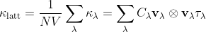

where <b><i>&kappa;</i></b><sub><i>&lambda;</i></sub> are the modal thermal conductivities, <i>C</i><sub><i>&lambda;</i></sub> are the (volumetric) heat capacities, <b><i>v</i></b><sub><i>&lambda;</i></sub> &otimes; <b><i>v</i></b><sub><i>&lambda;</i></sub> are the tensor products of the group velocities, <i>&tau;</i><sub><i>&lambda;</i></sub> are the lifetimes, *V* is the volume of the unit cell and *N* is the number of phonon wavevectors (<b><i>q</i></b>) included in the summation.

The <i>C</i><sub><i>&lambda;</i></sub> and <b><i>v</i></b><sub><i>&lambda;</i></sub> are calculated within the harmonic approximation.
<i>&tau;</i><sub><i>&lambda;</i></sub> are calculated as the inverse of the phonon linewidths &Gamma;<sub><i>&lambda;</i></sub> as:

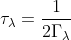

&Gamma;<sub><i>&lambda;</i></sub> are calculated as a sum of three-phonon scattering processes (collision and decay events) whose probabilities are determined as the product of a three-phonon interaction strength &Phi;<sub><i>&lambda;</i><i>&lambda;'</i><i>&lambda;''</i></sub> and a set of conservation of energy terms:

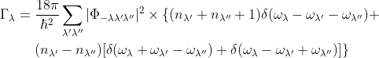

where <i>&omega;</i><sub><i>&lambda;</i></sub> are the phonon frequencies and <i>n</i><sub><i>&lambda;</i></sub> are the mode occupation numbers.

The averaged three-phonon interaction strength <i>P</i><sub><i>&lambda;</i></sub> are a useful quantitative measure of how strongly the phonons in a given material interact:

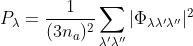

where <i>n</i><sub><i>a</i></sub> is the number of atoms in the primitive cell and there are thus 3<i>n</i><sub><i>a</i></sub> at each wavevector.

Analysing the various modal properties can extract additional information from Phono3py calculations, and when comparing materials can be used to explain *why* a material has a particularly high or low thermal conductivity.
The aim of `phono3py-mode-plot` is to provide an easy-to-use, but flexible, tool to do this.


## Brief tutorial


### a. Typical usage

A typical usage of `phono3py-mode-plot` is to generate scatter plots showing the frequncy dependence of modal quantities.
Invoking the script with just an input file plots the frequency spectrum of the averaged modal thermal conductivity <i><span style="text-decoration: overline;">&kappa;</span></i><sub><i>&lambda;</i></sub> = (<i>&kappa;</i><sub><i>xx</i></sub> + <i>&kappa;</i><sub><i>yy</i></sub> + <i>&kappa;</i><sub><i>zz</i></sub>) / 3:

```bash
$ phono3py-mode-plot kappa-m161616.hdf5
```

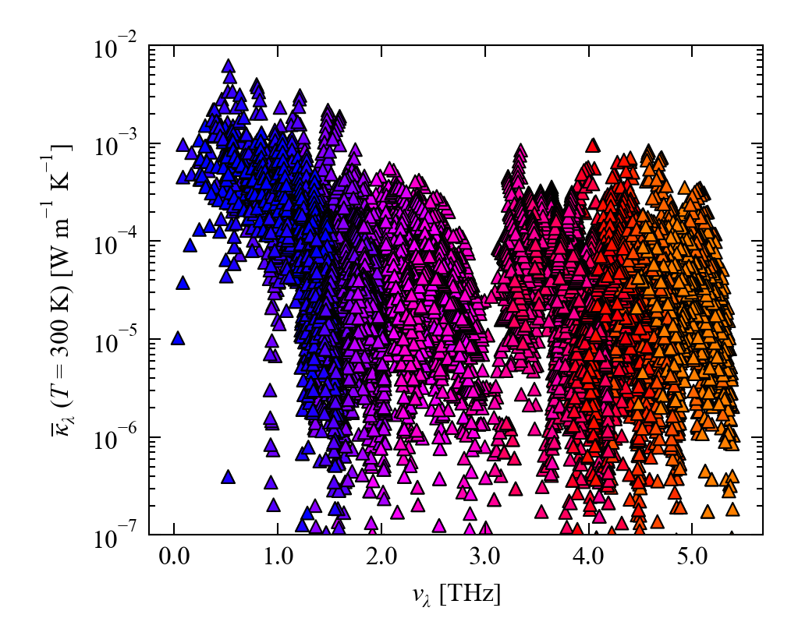

By default, the output file is named as `kappa-m161616.png`, but this can be changed using the `-o` option:

```bash
$ phono3py-mode-plot kappa-m161616.hdf5 -o SnSe-Kappa.png
```

`phono3py-mode-plot` can plot a range of modal quantities by setting the `--plot-y` option.
The available keywords are summarised in the following table:

<table>
  <tr>
    <th>Keyword    </th>
    <th>Description</th>
  </tr>
  <tr>
    <td><samp>freq</samp></td>
    <td>Frequencies <i>&nu;</i><sub><i>&lambda;</i></sub></td>
  </tr>
  <tr>
    <td><samp>kappa</samp></td>
    <td>Averaged thermal conductivity <i><span style="text-decoration: overline;">&kappa;</span></i><sub><i>&lambda;</i></sub></td>
  </tr>
  <tr>
    <td><samp>cv</samp></td>
    <td>Heat capacity <i>C</i><sub><i>&lambda;</i></sub></td>
  </tr>
  <tr>
    <td><samp>gv</samp></td>
    <td>Group velocity norms |<b><i>v</i></b><sub><i>&lambda;</i></sub>|</td>
  </tr>
  <tr>
    <td><samp>gamma</samp></td>
    <td>Linewidths &Gamma;<sub><i>&lambda;</i></sub></td>
  </tr>
  <tr>
    <td><samp>tau</samp></td>
    <td>Lifetimes &tau;<sub><i>&lambda;</i></sub></td>
  </tr>
  <tr>
    <td><samp>mfp</samp></td>
    <td>Mean-free path norms |<b>&Lambda;</b><sub><i>&lambda;</i></sub>|</td>
  </tr>
  <tr>
    <td><samp>pp</samp></td>
    <td>Averaged ph-ph interaction strengths <i>P</i><sub><i>&lambda;</i></sub></td>
  </tr>
</table>

Our first port of call is generally to compare the modal terms in the <b><i>&kappa;</i></b><sub>latt</sub> equation above.
We also use the `--x-range`, `--y-range` and `--scatter-marker` options to customise the plots:

```bash
$ phono3py-mode-plot kappa-m161616.hdf5 \
    --x-range="0 5.5" -o SnSe-Kappa.png

$ phono3py-mode-plot kappa-m161616.hdf5 --plot-y='cv' \
    --x-range="0 5.5" --y-range="8.0 8.7" --scatter-marker='o' \
    -o SnSe-CV.png

$ phono3py-mode-plot kappa-m161616.hdf5 --plot-y='gv' \
    --x-range="0 5.5" --scatter-marker='s' \
    -o SnSe-GV.png

$ phono3py-mode-plot kappa-m161616.hdf5 --plot-y='tau' \
    --x-range="0 5.5" --scatter-marker='p' \
    -o SnSe-Tau.png
```

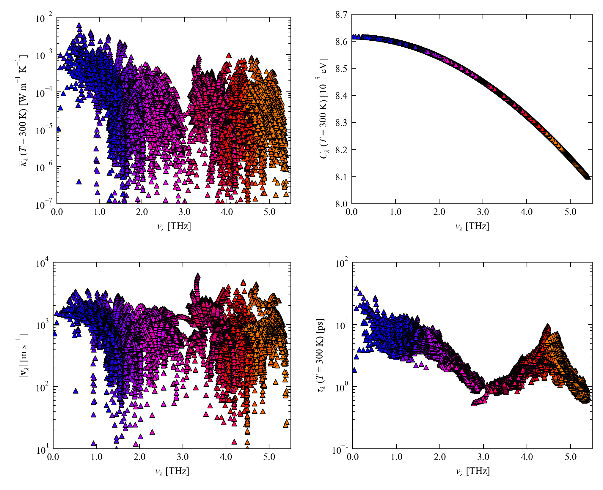

The analagous `--plot-x` option can be used to select a different modal quantity to plot on the x axis - for example, there is usually a good correlation between <i><span style="text-decoration: overline;">&kappa;</span></i><sub><i>&lambda;</i></sub> and the mean-free paths |<b>&Lambda;</b><sub><i>&lambda;</i></sub>| = |<b><i>v</i></b><sub><i>&lambda;</i></sub>| &times; <i>&tau;</i><sub><i>&lambda;</i></sub>:

```bash
$ phono3py-mode-plot kappa-m161616.hdf5 --plot-x='mfp' -o SnSe-MFP-Kappa.png
```

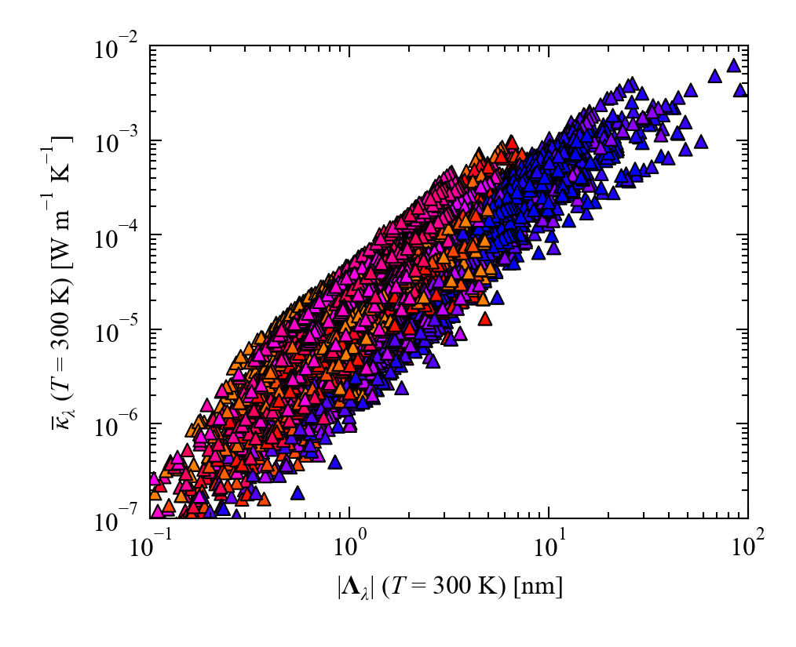

The program can also be used to compare the &Gamma;<sub><i>&lambda;</i></sub> to the <i>P</i><sub><i>&lambda;</i></sub> (note that the <i>P</i><sub><i>&lambda;</i></sub> are only calculated if the `--full-pp` option was set during the Phono3py calculation):

```bash
$ phono3py-mode-plot kappa-m161616.hdf5 --plot-y='gamma' \
    --x-range="0 5.5" -o SnSe-Gamma.png

$ phono3py-mode-plot kappa-m161616.hdf5 --plot-y='pp' \
    --x-range="0 5.5" --y-range="5e-12 1e-9" --scatter-marker='o' \
    -o SnSe-PP.png
```

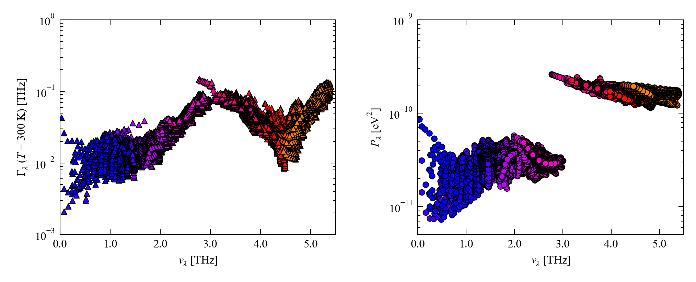

Finally, for *T*-dependent quantities a temperature can be selected with the `--temp` option (the default is 300 K):

```bash
$ phono3py-mode-plot --plot-y='tau' --x-range="0 5.5" -o SnSe-Tau-750.png
$ phono3py-mode-plot --plot-y='tau' --temp=750 --x-range="0 5.5" -o SnSe-Tau-750.png
```

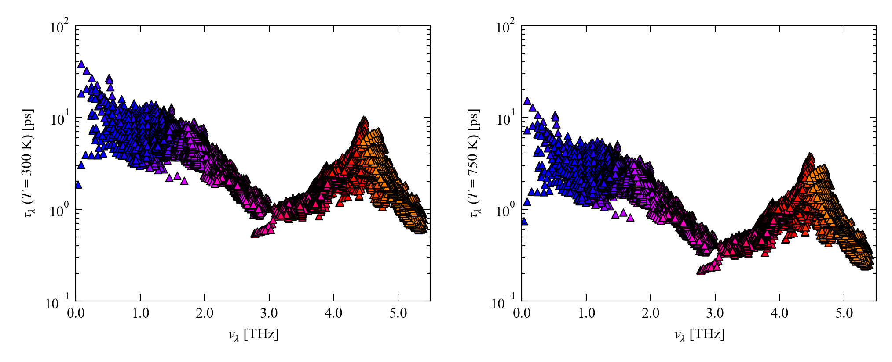


### b. Histogram plots

As an alternative to scatter plots, `phono3py-mode-plot` can also generate 2D histograms, which can show additional information with a colour map.
Histogram plots are selected with the `--hist` argument:

```bash
$ phono3py-mode-plot kappa-m161616.hdf5 --plot-y='gv' --hist \
    --x-range="0 5.5" -o SnSe-GV-Hist.png
```


By default, the histogram is coloured by the number (density) of modes.
However, the individual modes can be weighted by any of the modal quantities using the `--plot-c` option - e.g.:

```bash
$ phono3py-mode-plot kappa-m161616.hdf5 --plot-y='gv' --plot-c='kappa' \
    --hist --x-range="0 5.5" -o SnSe-GV-Hist-Kappa.png
```

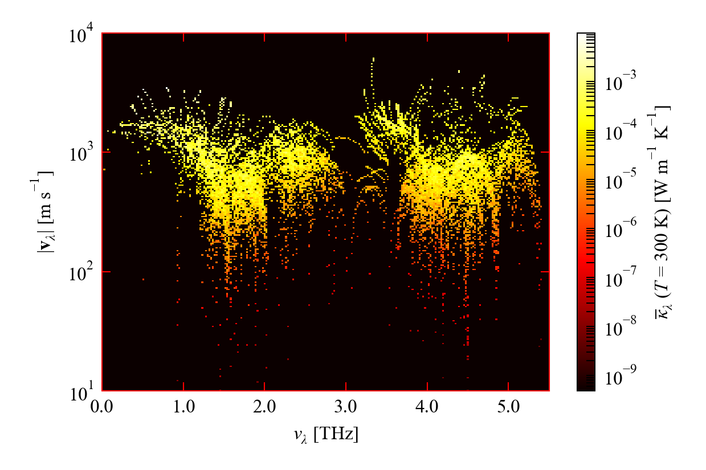

This plot not only shows the frequency spectrum of the |<b><i>v</i></b><sub><i>&lambda;</i></sub>|, but also provides information on how modes with different <i>&nu;</i><sub><i>&lambda;</i></sub> and |<b><i>v</i></b><sub><i>&lambda;</i></sub>| contribute to the thermal conductivity.

If plotting multiple quantities, it is usually desirable to treat the colour scale "qualitatively" and remove the colour bar.
The colour bar can be omitted by specifying the `--hist-no-cbar` option.
To obtain a consistent colour gradient across a set of plots, it is useful to set a common minimum and maximum value for colour normalisation using the `--hist-norm` option (appropriate values can be found by inspecting individual plots):

```bash
$ phono3py-mode-plot kappa-m161616.hdf5 --plot-c='kappa' --hist \
    --hist-no-cbar --hist-norm="1e-8 1e-2" --x-range="0 5.5" \
    -o SnSe-Kappa-Hist-Kappa.png

$ phono3py-mode-plot kappa-m161616.hdf5 --plot-y='cv' --plot-c='kappa' --hist \
    --hist-no-cbar --hist-norm="1e-8 1e-2" --x-range="0 5.5" --y-range="8.0 8.7" \
    -o SnSe-CV-Hist-Kappa.png

$ phono3py-mode-plot kappa-m161616.hdf5 --plot-y='gv' --plot-c='kappa' --hist \
    --hist-no-cbar --hist-norm="1e-8 1e-2" --x-range="0 5.5" \
    -o SnSe-GV-Hist-Kappa.png

$ phono3py-mode-plot kappa-m161616.hdf5 --plot-y='tau' --plot-c='kappa' --hist \
    --hist-no-cbar --hist-norm="1e-8 1e-2" --x-range="0 5.5" \
    -o SnSe-Tau-Hist-Kappa.png
```

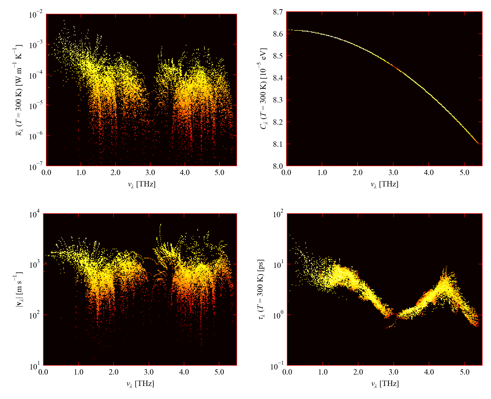

Finally, the colour map used for plotting can be set using the `--hist-cmap` parameter:

```bash
$ phono3py-mode-plot kappa-m161616.hdf5 --plot-y='gv' --plot-c='kappa' \
    --hist --hist-cmap='plasma' --x-range="0 5.5" \
    -o SnSe-GV-Hist-Kappa-Plasma.png

$ phono3py-mode-plot kappa-m161616.hdf5 --plot-y='gv' --plot-c='kappa' \
    --hist --hist-cmap='jet' --x-range="0 5.5" \
    -o SnSe-GV-Hist-Kappa-Jet.png
```

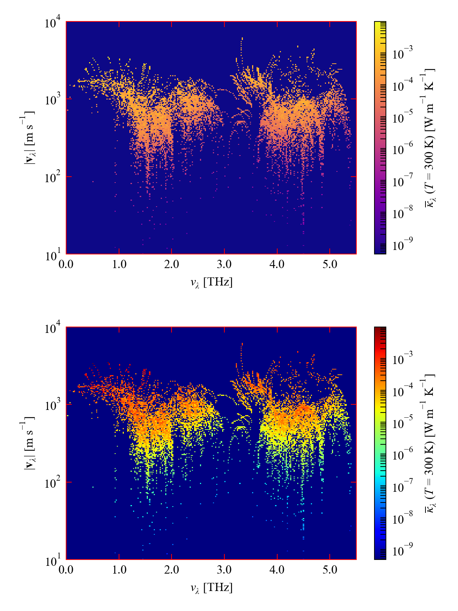


### c. Additional customisation

`phono3py-mode-plot` provides a number of parameters that can be used to customise the plots it generates - a full list can be seen with the `-h` option.
Particularly useful options are summarised in the following table, some of which appear in the examples in the previous two sections:

<table>
  <tr>
    <td><samp>--x-range</samp>, <samp>--y-range</samp></td>
    <td>Set the x/y-axis ranges</td>
    <td>&nbsp;</td>
  </tr>
  <tr>
    <td><samp>--x-scale</samp>, <samp>--y-scale</samp>, <samp>--c-scale</samp></td>
    <td>Set the x/y-axis scales and colour scale for histogram plots</td>
    <td><samp>linear</samp>, <samp>log</samp></td>
  </tr>
  <tr>
    <td><samp>--hist-res</samp></td>
    <td>Set the resolution (number of bins) for histogram plots</td>
    <td>&nbsp;</td>
  </tr>
  <tr>
    <td><samp>--scatter-marker</samp></td>
    <td>Set the marker style for scatter plots</td>
    <td>&nbsp;</td>
  </tr>
  <tr>
    <td><samp>--scatter-colour-by-band</samp></td>
    <td>Set the gradient scheme used to colour markers in scatter plots by band index</td>
    <td><samp>fire</samp>, <samp>ice</samp></td>
  </tr>
  <tr>
    <td><samp>--scatter-colour</samp></td>
    <td>Set a solid colour for markers in scatter plots (overrides <samp>--colour-by-band</samp></td>
    <td>&nbsp;</td>
  </tr>
  <tr>
    <td><samp>--scatter-marker-size</samp></td>
    <td>Set the marker size for scatter plots</td>
    <td>&nbsp;</td>
  </tr>
  <tr>
    <td><samp>--hist-cmap</samp></td>
    <td>Set the colour map for histogram plots</td>
    <td>&nbsp;</td>
  </tr>
  <tr>
    <td><samp>--hist-no-cbar</samp></td>
    <td>Omit the colour bar from histogram plots</td>
    <td>&nbsp;</td>
  </tr>
  <tr>
    <td><samp> --hist-norm</samp></td>
    <td>Set the minimum/maximum values used to normalise the colour scale in histogram plots</td>
    <td>&nbsp;</td>
  </tr>
</table>

Most of the modal properties typically vary by several orders of magnitue and are therefore plotted on a logarithmic scale by default.
This can be changed by setting the `--x-scale` and `--y-scale` options to `linear` or `log`:

```bash
$ phono3py-mode-plot kappa-m161616.hdf5 --x-range="0 5.5" -o SnSe-Kappa-Log.png

$ phono3py-mode-plot kappa-m161616.hdf5 --x-range="0 5.5" --y-range="0 0.7" \
    --y-scale=linear -o SnSe-Kappa-Linear.png
```


Note that when using a linear scale quantities with characteristically small values are scaled to a sensible "order of magnitude" - for example the <i><span style="text-decoration: overline;">&kappa;</span></i><sub><i>&lambda;</i></sub> are plotted in units of 10<sup>-2</sup> W m<sup>-1</sup> K<sup>-1</sup>.

An analagous `--c-scale` parameter can be used to select linear or logarithmic colour scales for colouring histogram plots:

```bash
$ phono3py-mode-plot kappa-m161616.hdf5 --hist --x-range="0 5.5" \
    -o SnSe-Kappa-Hist-Kappa-LogColour.png

$ phono3py-mode-plot kappa-m161616.hdf5 --hist --x-range="0 5.5" \
    --c-scale='linear' -o SnSe-Kappa-Hist-LinearColour.png
```

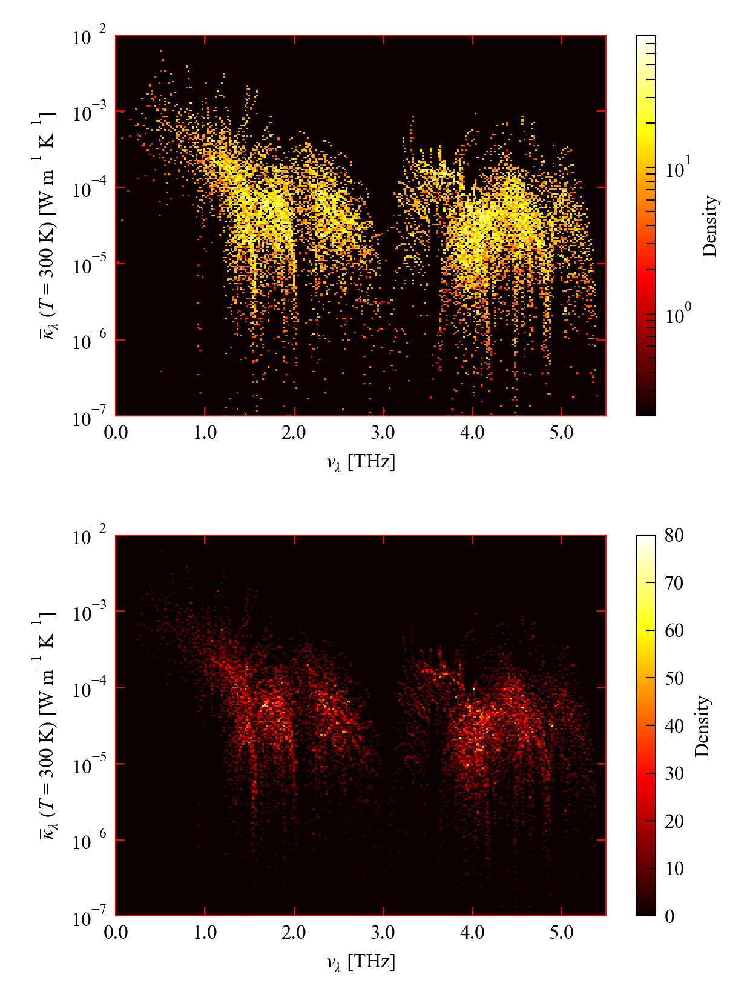

For scatter plots, the default colour scheme is to colour the markers by band index, which produces a colour gradient when the frequencies are used as the x axis.
The default scheme for doing this is the blue -> red `fire` scheme.
An alternative blue -> cyan `ice` scheme can be selected using the `--colour-by-band` option:

```bash
$ phono3py-mode-plot kappa-m161616.hdf5 --plot-y='gv' --x-range="0 5.5" \
    -o SnSe-GV-Fire.png

$ phono3py-mode-plot kappa-m161616.hdf5 --plot-y='gv' --x-range="0 5.5" \
    --scatter-colour-by-band='ice' -o SnSe-GV-Ice.png
```

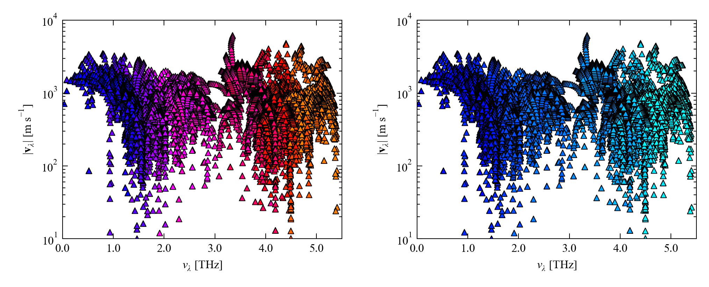


Alternatively, a single solid colour can be selected with the `--scatter-marker-colour` option, which overrides `--colour-by-band`:

```bash
$ phono3py-mode-plot kappa-m161616.hdf5 --x-range="0 5.5" \
    --scatter-marker-colour='b' -o SnSe-Kappa.png

$ phono3py-mode-plot kappa-m161616.hdf5 --plot-y='cv' \
    --x-range="0 5.5" --y-range="8.0 8.7" --scatter-marker='o' \
    --scatter-marker-colour='r' -o SnSe-CV.png

$ phono3py-mode-plot kappa-m161616.hdf5 --plot-y='gv' \
    --x-range="0 5.5" --scatter-marker='s' --scatter-marker-colour='g' \
    -o SnSe-GV.png

$ phono3py-mode-plot kappa-m161616.hdf5 --plot-y='tau' \
    --x-range="0 5.5" --scatter-marker='p' --scatter-marker-colour='orange' \
    -o SnSe-Tau.png
```

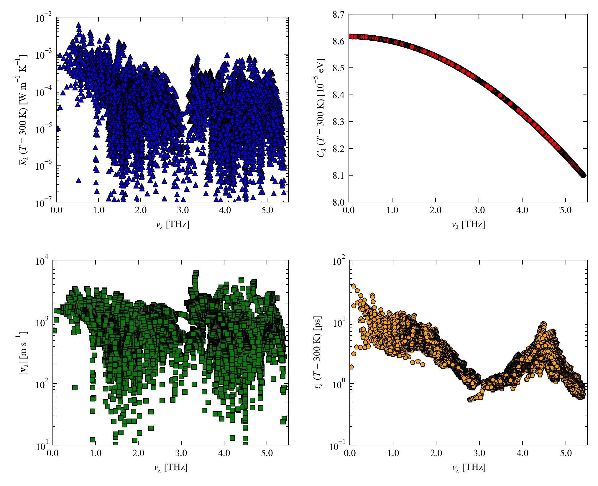


## FAQs and Troubleshooting


### I want a PDF/EPS/TIFF/JPEG file instead of a PNG

You can do this by setting an output file name (`-o`) with the extension of the file type you want - e.g.:

```bash
$ phono3py-mode-plot kappa-m161616.hdf5 -o SnSe-Kappa.pdf
$ phono3py-mode-plot kappa-m161616.hdf5 -o SnSe-Kappa.eps
$ phono3py-mode-plot kappa-m161616.hdf5 -o SnSe-Kappa.tiff
$ phono3py-mode-plot kappa-m161616.hdf5 -o SnSe-Kappa.jpg
```


### I get runtime warnings about masked data points and/or division by zero

You may see warnings similar to either or both of the following while running the script - provided the data in the input file is "sane" these should not affect the output and can be safely ignored:

```
/Volumes/Data/Repositories/Phono3py-Power-Tools/phono3py-mode-plot:492:
 RuntimeWarning: An additional 21 data points with values <= 0 were masked.
  "An additional {0} data points with values <= 0 were masked.".format(num_mask_2 - num_mask_1), RuntimeWarning
```

```
/Volumes/Data/Repositories/Phono3py-Power-Tools/Phono3pyPowerTools/Phono3pyIO.py:246:
 RuntimeWarning: divide by zero encountered in divide
  mode_gamma > 0.0, 1.0 / (2.0 * 2.0 * math.pi * mode_gamma), 0.0
```


### I get warnings about missing fonts and my plot renders in DejaVu Sans

Unless the `--mpl-default` option is set, `phono3py-mode-plot` tries to render plots using the Times New Roman font.
On some Python installations you will see an error message such as the following and the plot will be rendered in (fairly plain) DejaVu Sans:

```
/mnt/iusers01/fatpou01/chem02/w35422js/Miniconda/miniconda2/lib/python2.7/site-packages/matplotlib/font_manager.py:1331:
 UserWarning: findfont: Font family [u'Times New Roman'] not found. Falling back to DejaVu Sans
  (prop.get_family(), self.defaultFamily[fontext]))
```

Fixing "missing" Matplotlib fonts can be tricky - as a quick Google search will attest - but if you are using Anaconda or Miniconda (recommended) you can install Times New Roman to the right place by installing the `mscorefonts` package:

`conda install -c conda-forge mscorefonts`


## Notes and references

The equations in this document were produced using the [Online LaTeX Equation Editor](https://www.codecogs.com/latex/eqneditor.php) from [CodeCogs](https://www.codecogs.com/).

1. <a name="Ref1"></a> A. Togo, L. Chaput and I. Tanaka, *Physical Review B* **91**, 093206 (**2015**), DOI: [10.1103/PhysRevB.91.094306](https://doi.org/10.1103/PhysRevB.91.094306)