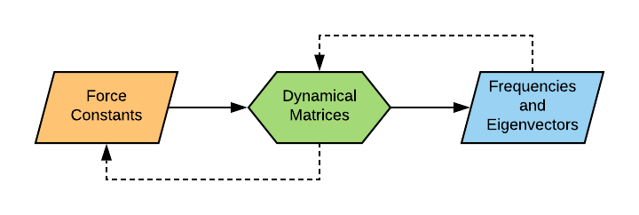

# Phonopy-Importer


This code is designed to allow modelling codes that can perform phonon calculations to be interfaced to the Phonopy code[<a href="#Ref1">1</a>] for post processing.


## Method

In a finite-displacement phonon calculation, a set of force-constant matrices &Phi;<sub><i>&alpha;&beta;</i></sub>(<i>jl</i>,<i>j'l'</i>) are computed in real space and used to construct dynamical matrices <i>D<sub>&alpha;&beta;</sub></i>(<i>jj'</i>,<b>q</b>), which when diagonalised give the vibrational frequencies &omega;(<b>q</b>,<i>v</i>) and eigenvectors <i><b>W</b></i>(<b>q</b>,<i>v</i>).

PhonopyImporter uses the `DynmatToForceConstants` API from Phonopy to reverse this workflow: the frequencies and eigenvectors from a completed phonon calculation are used to reconstruct the dynamical matrices, which are then reverse-transformed to a set of force constant matrices that can be used for further post-processing in Phonopy.

<p align="center">
    
</p>


## Installation

Phonopy-Importer is supplied as a Python module, `PhonopyImporter`, and a set of command-line scripts.

For infrequent use, it is probably most straightforward to clone the repository, copy the `PhonopyImporter` folder and the command-line script(s) you need to your working directory, and call them there.

Alternatively, code can be installed by adding the root folder of the repository to the `PATH` and `PYTHONPATH` variables, e.g.:

```bash
> export PATH=${PATH}:/mnt/d/Repositories/Phono3py-Power-Tools/PhonopyImporter
> export PYTHONPATH=${PYTHONPATH}:/mnt/d/Repositories/Phono3py-Power-Tools/PhonopyImporter
```

`PhonopyImporter` uses the Phonopy Python API, so Phonopy must be installed to use it, and also requires `NumPy`.


## Code support

### CASTEP

The `castep2phonopy` script reads a CASTEP .phonon file and extracts a structure (`POSCAR.vasp`) and set of force constants (`FORCE_CONSTANTS`) that can be used with Phonopy.

```
> castep2phonopy -h
usage: castep2phonopy [-h] -s <seedname> -d <dim_1 dim_2 dim_3>

Convert a CASTEP .phonon file to a POSCAR and FORCE_CONSTANTS file for post-
processing in Phonopy

optional arguments:
  -h, --help            show this help message and exit
  -s <seedname>, --seedname <seedname>
                        CASTEP .phonon file <seedname>.phonon (e.g.
                        --seedname="castep")
  -d <dim_1 dim_2 dim_3>, --dim <dim_1 dim_2 dim_3>
                        Equivalent supercell expansion [dim_1, dim_2, dim_3]
                        for building force constants (e.g. --dim="1 1 1")
```

For example, to convert a &Gamma;-point CASTEP calculation output into "castep.phonon":

```
> castep2phonopy -s castep --dim="1 1 1"
```


## Bugs and feature requests

At the time of writing, this code has only been tested for &Gamma;-point calculations in CASTEP.
If you encounter bugs while using this code, please let us know - it will speed up the process a lot if you can provide a detailed description of the problem and input file(s) that reproduce the error.

We are also happy to take requests to support other codes that do not have a Phonopy interface.
If you would like us to add support for another code, please let us know - again, a detailed description of the output format will be helpful.


## References

1. <a name="Ref1"></a> [https://atztogo.github.io/phonopy/](https://atztogo.github.io/phonopy/)